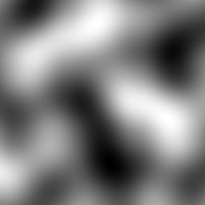

# Perlin Noise

Simple 2D Perlin noise implementation in Python.
It uses the improved interpolation scheme[1] but no other trick.

[1]: Perlin, K. (2002). Improving noise. ACM Transactions on Graphics, 21(3), 681–682. https://doi.org/10/bg3dbg

